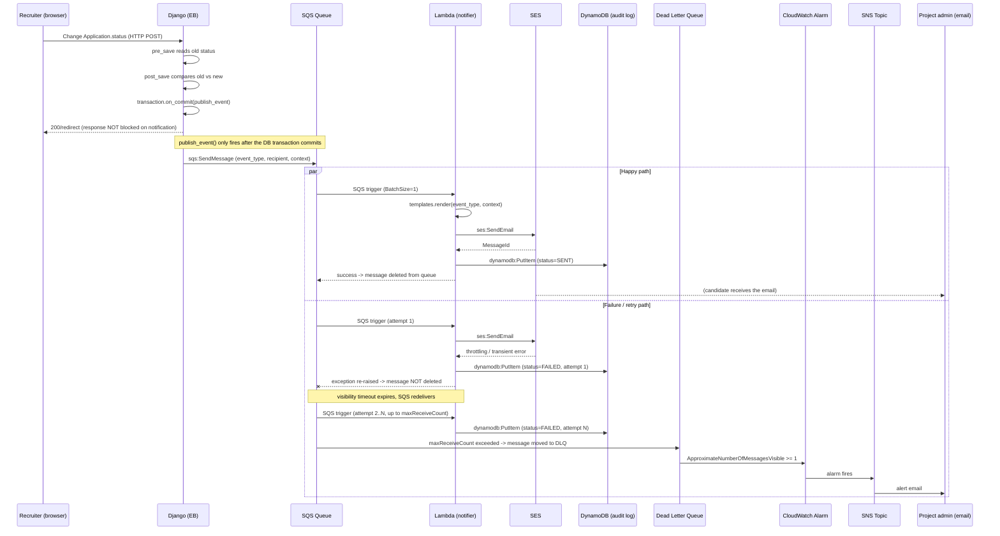

# Notification Flow — Sequence Diagram

Covers both the happy path and the failure/DLQ path for a single event (e.g. an
`Application.status` change). `interview_scheduled` follows the identical shape,
just triggered from `Interview`'s `post_save` signal instead.

## Poison-pill path (not shown above for clarity)

If `event_type` is unrecognized or the message is missing required template
context fields, the Lambda treats this as unrecoverable: it logs a `FAILED`
entry to DynamoDB and returns normally (does **not** raise), so SQS deletes the
message immediately without redelivery. Retrying a malformed message can never
succeed, so it deliberately skips the DLQ path above rather than wasting
`maxReceiveCount` attempts on it.
